# github-lang-to-icon

<!-- TODO: 사용법 -->
<!-- TODO: Features (lowercase, props, devicon based) -->
<!-- TODO: 이미지 목록  -->
<!-- TODO: 이미지 출처  -->
<!-- TODO: CHANGELOG.md  -->

<p align="center">
  <a href="https://www.npmjs.com/package/@altenull/github-lang-to-icon" target="_blank">
    
  </a>
  <a href="https://www.npmjs.com/package/@altenull/github-lang-to-icon" target="_blank">
    
  </a>
  <a href="https://github.com/altenull/github-lang-to-icon/blob/master/LICENSE" target="_blank">
    
  </a>
  <a href="https://reactjs.org/" target="_blank">
    
  </a>
  <a href="https://www.typescriptlang.org/" target="_blank">
    
  </a>
</p>

<p align="center">
  <b>React component that converts the GitHub language into an icon.</b><br />
</p>

## ⚙ Installation

#### npm

```bash
$ npm install --save @altenull/github-lang-to-icon
```

## Getting Started

### Supported Languages

| Language       | Icon(svg)                                                      |
| -------------- | -------------------------------------------------------------- |
| 'C'            |             |
| 'Clojure'      | 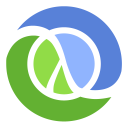      |
| 'CoffeeScript' |  |
| 'C++'          | 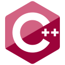          |
| 'C#'           | 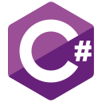       |
| 'CSS'          |           |
| 'Dart'         |          |
| 'Elixir'       | 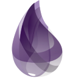       |
| 'Elm'          |           |
| 'Erlang'       |        |
| 'F#'           |        |
| 'Go'           |            |
| 'Groovy'       |        |
| 'Haskell'      | 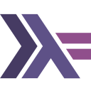      |
| 'HTML'         |          |
| 'Java'         | 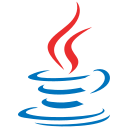         |
| 'JavaScript'   | 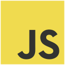   |
| 'Julia'        |         |
| 'Kotlin'       |        |
| 'Lua'          | 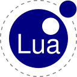          |
| 'Markdown'     |      |
| 'MATLAB'       |        |
| 'Nix'          | 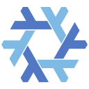          |
| 'Objective-C'  | 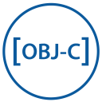  |
| 'OCaml'        |         |
| 'Perl'         |          |
| 'PHP'          |           |
| 'Python'       |        |
| 'R'            |             |
| 'Ruby'         | 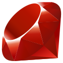         |
| 'Rust'         |          |
| 'Scala'        | 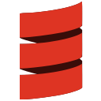        |
| 'SCSS'         | 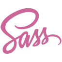         |
| 'Shell'        |         |
| 'Stylus'       | 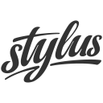       |
| 'Swift'        | 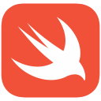        |
| 'TypeScript'   |    |
| 'Vim Script'   |    |

## 📝 License

Licensed under the [MIT](./LICENSE).
