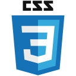

# github-lang-to-icon

<p align="center">
  <a href="https://www.npmjs.com/package/@altenull/github-lang-to-icon" target="_blank">
    
  </a>
  <a href="https://www.npmjs.com/package/@altenull/github-lang-to-icon" target="_blank">
    
  </a>
  <a href="https://github.com/altenull/github-lang-to-icon/blob/main/LICENSE" target="_blank">
    
  </a>
  <a href="https://reactjs.org/" target="_blank">
    
  </a>
  <a href="https://www.typescriptlang.org/" target="_blank">
    
  </a>
</p>

<p align="center">
  <b>React component that converts the GitHub language into an icon.</b><br />
</p>

## ⚙ Installation

```bash
$ npm install --save @altenull/github-lang-to-icon
```

## 🚀 Quick Start

```tsx
import { GithubLangToIcon } from '@altenull/github-lang-to-icon';

render() {
  return (
    <GithubLangToIcon
      lang="TypeScript"
      size={64}
    />
  );
}
```

### Props

|  Prop   |                Type                | Default |                     Description                     |
| :-----: | :--------------------------------: | :-----: | :-------------------------------------------------: |
| `lang`  | GithubLang \| LowercasedGithubLang |         | type LowercasedGithubLang = Lowercase\<GithubLang\> |
| `size`  |        number \| undefined         |   40    |                icon's width & height                |
| `style` |  React.CSSProperties \| undefined  |         |                                                     |

### Supported Languages

| GithubLang(type) |                                                  Icon(svg)                                                   |
| :--------------: | :----------------------------------------------------------------------------------------------------------: |
|       'C'        |                                                           |
|    'Clojure'     |                                                     |
|  'CoffeeScript'  |                                                |
|      'C++'       |                                                         |
|       'C#'       |                                                      |
|      'CSS'       |                                                         |
|      'Dart'      |                                                        |
|     'Elixir'     |                                                      |
|      'Elm'       |                                                         |
|     'Erlang'     |                                                      |
|       'F#'       |                                                      |
|       'Go'       |                                                          |
|     'Groovy'     |                                                      |
|    'Haskell'     |                                                     |
|      'HTML'      |                                                        |
|      'Java'      |                                                        |
|   'JavaScript'   |                                                  |
|     'Julia'      |                                                       |
|     'Kotlin'     |                                                      |
|      'Lua'       |                                                         |
|    'Markdown'    |                                                    |
|     'MATLAB'     |                                                      |
|      'Nix'       |                                                         |
|  'Objective-C'   |                                                 |
|     'OCaml'      |                                                       |
|      'Perl'      |                                                        |
|      'PHP'       |  |
|     'Python'     |                                                      |
|       'R'        |                                                           |
|      'Ruby'      |                                                        |
|      'Rust'      |                                                        |
|     'Scala'      |                                                       |
|      'SCSS'      |                                                        |
|     'Shell'      |                                                       |
|     'Stylus'     |                                                      |
|     'Swift'      |                                                       |
|   'TypeScript'   |                                                  |
|   'Vim Script'   |  |

## 📝 License

Licensed under the [MIT](./LICENSE).
